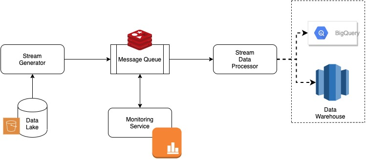

# streaming-gbq
We are exploring an architecture where we want stream a large file to google big query.

## Architecture
This project comprise of four services which are all containerized.
* Redis Server, `redis` (Queue)
* Stream Data generator, `stream_generator` (Publisher)
* Stream Data Processor, `stream_processor` (Consumer)
* Monitoring, `monitoring` (Monitoring/Alerting)

This architecture is based on a publisher-subscriber design. Here `stream_generator` is a publisher which is sending generating data points (chunks of 500 rows from the given csv file) to Message Queue. For this demo, given data file is being read from local file system which is mounted in corresponding docker container.

Redis is being used as a `message queue` broker. Here, we are using a single key of List type and leveraging it as a queue.

`stream_processor` is the subscriber of message queue. It takes message from queue, perform processing and send it to Data Warehouse e.g. to Google Big Query, or any other database.

Moreover, a simple `monitoring` service is also put in place which periodically monitor `message queue` and if number of messages increases a given threshold, then ideally an appropriate alert or action can be devised. We are outputting a simple error log here.



## Setup

### Preinstallations
`docker-compose` is used as container orchestration service.

Please install docker-compose (In mac/Linux system) using pip

`pip install docker-compose`

**Note**: Please change the placeholder `<enter-data-dir-path>` value in docker-compose.yaml which corresponds to "stream_generator" container. This value should point to the folder location of given csv file. E.g. if `data_source.csv` resides in `/Users/name/Downloads/` folder, then change the value of placeholder to this path.
Alternatively, one can also change the `config/config.py` file, for appropriate file_name changes.

### Run Services
Please run following command to build and run the respective containers
```
cd streaming-gbq
docker-compose build
docker-compose up -d 
```

## Next Steps, Improvements and Considerations

### Individual Component

#### Redis Container
1. Currently raw redis alpine image is being used without doing any redis config changes.
Based on performance/load benchmark, we can create a separate Dockerfile for redis server
accompanied by configuration changes

2. Redis server stores periodic snapshot in form of `rdb` file. Default storage location is at 
`/var/lib/redis/dump.rdb` (redis container) and this can be mapped to instance volumn and incorporate
backup snapshotting approach. Various approaches are listed [here](https://redis.io/topics/persistence)

3. Didn't open Redis port (default 6379) over redis container. One can consider to open it in case
we need to attach some specific external service to redis server.

4. Better error handling for Redis specially for cases when main memory is filled and redis server becomes unreacheable.

#### Stream Generator
1. Although this is a simple generator, we can put proper error handling for file IO processes.

#### Stream Processor
1. Data Quality checks

#### Monitoring Container
1. It should be attached to external monitoring services and send metrics e.g. prometheus, graphana, etc.

2. It should not be on the same instance.

### Overall Architecture
1. It supports single publisher and single subscriber assuming we need file chunks in the exact sequence. If chunk/events order doesn't matter, then multiple processors can be invoked to parallelize the pushing data to DWH. In proposed architecture, this can be done simply by increasing `stream_processor` containers with scale command e.g. `docker-compose scale stream_processor=4`

2. We need to incorporate proper logging infrastructure with various log handlers like graylog, etc., so that we can monitor various components and errors can be detected in near real time.

3. Redis is used as a queue for demo purposes. Ideally, it should be replaced by much performant and advanced queuing solutions like RabbitMQ, AWS SNS/SQS, etc. Furthermore, this can further be streamlined with using industry-standard streaming services like AWS Kinesis, Apache Kafka, etc.

4. Instead of using `stream_generator` and corresponding `stream_processor` in Pub-Sub architecture, for similar use cases, we can directly leverage and explore technologies specialized in stream processing like [structured streaming](https://spark.apache.org/docs/latest/structured-streaming-programming-guide.html). Moreover, for MPP data warehouses like GBQ, we can also perform a bulk data load operation directly from data lake e.g. [prepare statement in Snowflake](https://docs.snowflake.com/en/user-guide/data-load-considerations-prepare.html).

5. Although `docker-compose` is good enough for local/staging deployment, however for better docker image versioning and tagging, we should use Container Registries like ECR, dockerhub (private), etc.

### CI and tests
1. To keep code quality, we can use CI pipeline like `GitHub actions` to test pytests, linting and similar sanity checks.
